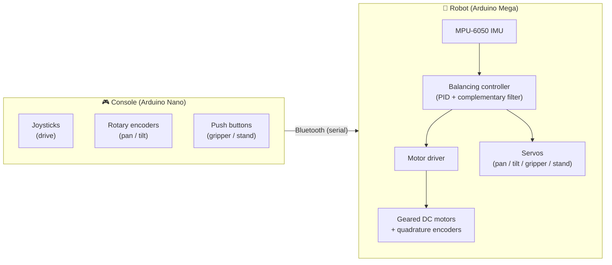

<div align="center">

# Steady Stride

### A two-wheeled self-balancing mobile robot with an onboard manipulator and wireless teleoperation

A ground-up robotics build that pairs a real-time embedded balancing controller with a model-based control study — from dynamic modelling and gain design in MATLAB to a tuned firmware stack running on hardware.

<br>


</div>

---

## Overview

**Steady Stride** is a two-wheeled self-balancing robot built around the classic *inverted-pendulum* control problem: an inherently unstable platform that must be continuously corrected to stay upright. The system fuses inertial sensing with a real-time feedback controller to keep the chassis balanced, while a wireless console lets an operator drive the robot and command an onboard pan–tilt–gripper manipulator.

The project spans the full engineering pipeline:

- **Dynamic modelling** of the cart–pendulum system as a linearised state-space model.
- **Controller design** — both a tuned PID loop deployed on hardware and an LQR optimal controller designed and simulated in MATLAB.
- **Embedded implementation** on a distributed two-microcontroller architecture communicating over Bluetooth.
- **Mechatronic integration** of the chassis, drivetrain, manipulator, and a deployable stand, validated through a documented test campaign.

> Steady Stride was developed as a capstone robotics project and accompanied by a formal manuscript and external technical review.

---

## Highlights

- ⚖️ **Real-time self-balancing** using an MPU-6050 IMU and a complementary filter for drift-free tilt estimation.
- 🎛️ **Dual control strategy** — a hand-tuned PID controller running on the robot, plus a full LQR state-feedback design with controllability analysis and step-response simulation.
- 📡 **Wireless teleoperation** over Bluetooth from a dedicated handheld console with joystick drive and rotary-encoder manipulator control.
- 🦾 **Onboard manipulator** — a servo-driven pan/tilt head and gripper for simple pick-and-interact tasks.
- 🦵 **Deployable safety stand** that can catch the chassis outside the stable operating envelope.
- 📐 **End-to-end documentation** — CAD model, circuit schematics, bill of materials, simulation scripts, a literature survey, and a test-video log.

---

## System Architecture

Steady Stride uses a **master–slave** topology that cleanly separates the human interface from the safety-critical balancing loop.



- The **console** reads operator inputs and streams compact command tokens over a Bluetooth serial link.
- The **robot** runs the balancing loop locally so stability never depends on the wireless link; incoming commands modulate the drive and actuate the manipulator.

---

## Control System

### 1. State estimation

Tilt angle is reconstructed by fusing the accelerometer and gyroscope of the MPU-6050 with a **complementary filter**, combining the gyroscope's clean short-term response with the accelerometer's long-term stability:

```cpp
double angle     = atan2(accelY, accelZ) * 180 / PI;   // accelerometer tilt
double gyroAngle = angle + (gyroX / 131.0) * 0.98;      // complementary blend
```

### 2. PID balancing controller

A discrete PID loop drives the wheel speed and direction to hold the chassis at the upright setpoint. The controller includes a dead-band around equilibrium with integral-term reset to suppress jitter, and the output is saturated to the motor PWM range.

```text
error  = setpoint − angle
output = Kp·error + Ki·∫error + Kd·Δerror
```

| Gain | Value     |
|------|-----------|
| `Kp` | `10.532`  |
| `Ki` | `18.338`  |
| `Kd` | `1.077`   |

### 3. LQR optimal control (model-based study)

The robot is modelled as a linearised inverted pendulum with state vector
**x = [position, velocity, tilt angle, angular velocity]**. The MATLAB study
([`LQR.m`](LQR.m)) builds the state-space model, verifies controllability,
solves the algebraic Riccati equation for the optimal feedback gain, and
simulates the closed-loop step response.

```matlab
A = [0      1        0       0;
     0  -0.0228   0.0549     0;
     0      0        0       1;
     0  -0.0585   3.3244     0];
B = [0; 0.228; 0; 0.77];

co = ctrb(sys_ss);          % controllability check
Q  = C' * C;  R = 1;
K  = lqr(A, B, Q, R);       % optimal state-feedback gain
```

This bridges classical hand-tuning with optimal control theory and provides a
principled baseline for comparing controller performance.

---

## Hardware

| Subsystem        | Components                                                            |
|------------------|----------------------------------------------------------------------|
| **Compute**      | Arduino Mega 2560 (robot) · Arduino Nano (console)                   |
| **Sensing**      | MPU-6050 6-axis IMU · quadrature wheel encoders                      |
| **Actuation**    | Geared DC drive motors via H-bridge driver · hobby servos (pan, tilt, gripper, stand) |
| **Comms**        | Bluetooth serial module (console ↔ robot)                           |
| **Structure**    | Custom chassis modelled in Fusion 360 (see `CAD/`)                   |
| **Power**        | Onboard rechargeable battery pack                                   |

> Wiring is documented in [`steady_stride_v0/Circuits/`](steady_stride_v0/Circuits) (robot and console electrical + I/O communication schematics), and a costed parts list is provided in `BOM.xlsx`.

---

## Teleoperation Controls

The console maps each physical input to a single-character command consumed by the robot's serial parser:

| Command  | Action                          |
|----------|---------------------------------|
| `1` / `2`| Drive forward / reverse         |
| `3` / `4`| Turn left / right               |
| `6` / `7`| Gripper close / open            |
| `8` / `9`| Pan head right / left           |
| `0` / `5`| Tilt head up / down             |
| `c` / `d`| Enable / disable self-balancing |

---

## Repository Structure

```
.
├── CAD/                          # Fusion 360 chassis model (.f3d)
├── Codes/                        # Standalone firmware sketches & sensor tools
│   ├── PID_control/              #   Balancing controller + encoder driver
│   ├── encoders/                 #   Quadrature encoder readout
│   ├── GyroPlot/                 #   IMU streaming / tuning aid
│   └── bluetooth2phone/          #   Bluetooth link bring-up
├── Gains Calcuation & SImulation/   # MATLAB LQR design & step-response sim
├── steady_stride_v0/             # Integrated demonstration build
│   ├── Codes/src/                #   master (console) + slave (robot) + manipulator
│   ├── Circuits/                 #   Electrical & I/O schematics
│   ├── Documentation/            #   Final report, presentation, test videos
│   └── Reference Papers/         #   Curated literature survey
└── README.md
```

---

## Getting Started

> Requires the [Arduino IDE](https://www.arduino.cc/en/software) (or Arduino CLI) and the bundled libraries under `steady_stride_v0/Codes/src/libraries_dependencies/`.

1. **Install dependencies** — copy the libraries from `libraries_dependencies/`
   into your Arduino `libraries` folder (key libraries: MPU6050, Adafruit MPU6050,
   Adafruit Unified Sensor, Servo).
2. **Flash the robot** — open `steady_stride_v0/Codes/src/slave_robot/slave/slave.ino`
   and upload it to the Arduino Mega.
3. **Flash the console** — open `steady_stride_v0/Codes/src/master_console/master/master.ino`
   and upload it to the Arduino Nano.
4. **Pair & calibrate** — pair the two Bluetooth modules, place the robot upright,
   and let the IMU offset calibration complete (do not move the robot during startup).
5. **Balance & drive** — send `c` to engage self-balancing, then teleoperate from the console.

> ℹ️ For tuning and bench testing, `Codes/PID_control/` and
> `steady_stride_v0/Codes/src/PID_control_stand/` provide standalone balancing
> sketches with live serial telemetry.

---

## Documentation

- 📄 **Technical report & presentation** — `steady_stride_v0/Documentation/`
- 🎥 **Validation videos** — recorded tests of the drivetrain, gripper, pan/tilt joint, and balancing behaviour across speeds and terrain
- 📚 **Literature survey** — a curated set of reference papers on two-wheeled self-balancing robots, inverted-pendulum control, and LQR/PID strategies

---

## Roadmap

- [ ] Replace PID with the LQR state-feedback controller on hardware and benchmark both
- [ ] Add wheel-encoder feedback into the balancing loop for position hold
- [ ] Sensor-fusion upgrade (Kalman filter) for sharper tilt estimation
- [ ] Autonomous navigation and obstacle avoidance
- [ ] Migrate compute to a single board and slim the wiring harness

---

## Author

**Manas Arumalla**
Robotics · Control Systems · Embedded Engineering

If you find this project interesting, a ⭐ on the repository is always appreciated.

---

## License

Released under the **MIT License**. See [`LICENSE`](LICENSE) for details.
